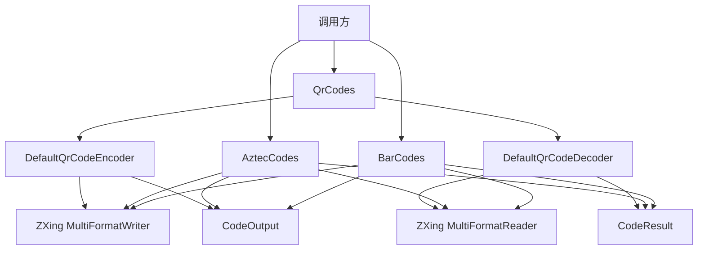

# zxing-extension

基于 ZXing Core 3.5.4 的纯 Java 扩展库，提供 QR Code、Aztec 和一维条形码的生成与解析。

本项目是独立 ZXing 扩展，不依赖 Spring、Spring Boot、Javalin、Quarkus 或 DDD4J。

> **本次更新（1.0.x 系列）**：补全 22 个源文件的中文 Javadoc；新增 19 个测试类，覆盖 187 个 `@Test` 方法；引入 JaCoCo 0.8.12 覆盖率门禁 + GitHub Actions CI。详见[测试覆盖](#测试覆盖)。

## 能力

- QR Code：PNG、SVG、Base64、Data URI、彩色渐变、码眼颜色、Logo、外套壳、单码与多码解析。
- Aztec：尺寸、纠错百分比、quiet zone、PNG、Base64、常见输入解析。
- 一维条形码：EAN-8/13、UPC-A/E、Code 39/93/128、ITF、Codabar。
- 统一结果：所有码制共用 `CodeOutput` 和 `CodeResult`。
- JDK 8：不使用更高版本 Java API。
- 完善的中文 Javadoc 与 Jacoboco 覆盖率门禁。

## Maven

```xml
<dependency>
    <groupId>io.github.hiwepy</groupId>
    <artifactId>zxing-extension</artifactId>
    <version>1.0.x.20260630-SNAPSHOT</version>
</dependency>
```

## 快速开始

### QR Code

```java
// 普通二维码
QrCodeOutput normal = QrCodes.encode("https://github.com/hiwepy");

// 彩色二维码
QrCodeOutput colorful = QrCodes.colorful("https://github.com/hiwepy");

// 带 Logo
BufferedImage logo = ImageIO.read(new File("logo.png"));
QrCodeOutput withLogo = QrCodes.withLogo("https://github.com/hiwepy", logo);

// 字节、Base64 和 Data URI
byte[] png = colorful.getBytes();
String base64 = colorful.base64();
String dataUri = colorful.dataUri();

// 解析
QrCodeDecodeResult result = QrCodes.decode(png);
String content = result.getText();
```

高级生成使用 `QrCodeRequest`：

```java
QrCodeOutput output = QrCodes.encoder().encode(
    QrCodeRequest.builder("hello")
        .size(430, 430)
        .margin(2)
        .errorCorrectionLevel(ErrorCorrectionLevel.H)
        .style(QrCodeStyle.builder()
            .foregroundColor(new Color(0, 122, 98))
            .gradientEndColor(new Color(69, 54, 143))
            .eyeColor(new Color(24, 45, 110))
            .build())
        .logo(QrCodeLogo.builder(logo).size(56, 28).build())
        .selfCheck(true)
        .build());
```

输出 SVG：

```java
QrCodeOutput svg = QrCodes.encoder().encode(
    QrCodeRequest.builder("hello")
        .format(QrCodeImageFormat.SVG)
        .build());
```

外套壳使用 `QrCodeFrame` 组合二维码、文字和图片元素：

```java
QrCodeFrame frame = QrCodeFrame.builder(420, 520)
    .addElement(QrCodeTextElement.builder("扫码查看详情")
        .bounds(100, 30, 260, 40)
        .font("SansSerif", 28, true)
        .build())
    .addElement(QrCodeBlockElement.builder()
        .x(50).y(100).width(320).height(320).zIndex(1)
        .build())
    .build();
```

多码解析：

```java
List<QrCodeDecodeResult> results = QrCodes.decoder().decode(
    QrCodeDecodeRequest.from(image)
        .multiple(true)
        .build());
```

### Aztec

```java
// 快捷生成与解析
CodeOutput output = AztecCodes.encode("hello-aztec");
CodeResult result = AztecCodes.decode(output.getBytes());

// 自定义尺寸、纠错百分比和 quiet zone
CodeOutput custom = AztecCodes.encode(
    AztecCodeRequest.builder("hello-aztec")
        .size(320, 280)
        .errorCorrectionPercent(40)
        .margin(4)
        .build());
```

### 一维条形码

```java
// EAN-13 快捷入口
CodeOutput ean13 = BarCodes.ean13("6901234567892");
CodeResult result = BarCodes.decode(ean13.getBytes());

// 其他一维码制
CodeOutput code128 = BarCodes.encode(
    BarCodeRequest.builder("ORDER-20260715", BarcodeFormat.CODE_128)
        .size(360, 120)
        .margin(8)
        .build());
```

## 输入与输出

三个门面保持一致的使用模式：

| 门面 | 快捷生成 | 高级生成 | 解析输入 |
|---|---|---|---|
| `QrCodes` | `encode`、`colorful`、`withLogo` | `QrCodeRequest` | `byte[]`、`BufferedImage`、`File`、`Path`、`InputStream` |
| `AztecCodes` | `encode` | `AztecCodeRequest` | 同上 |
| `BarCodes` | `ean13` | `BarCodeRequest` | 同上 |

`CodeOutput` 提供：

- `getBytes()`
- `image()`
- `base64()`
- `dataUri()`
- `writeTo(OutputStream)`
- `getWidth()` / `getHeight()` / `getMimeType()`

调用方传入的 `InputStream` 和 `OutputStream` 均不会被库关闭。

## 架构



设计约束：

- QR 的 L/M/Q/H 与 Aztec 的纠错百分比不是同一语义，因此分别建模。
- 一维码制没有 Logo、渐变和外套壳，不暴露无效参数。
- 三种码制共享真正相同的输出与解析结果，不使用弱类型 hints 作为公共 API。
- 核心模块不下载远程 URL，避免引入 SSRF 风险。

## 主要结构

```text
com.google.zxing
├── QrCodes.java
├── AztecCodes.java
├── BarCodes.java
├── DefaultQrCodeEncoder.java
├── DefaultQrCodeDecoder.java
├── QrCodeEncoder.java
├── QrCodeDecoder.java
├── CodeImageSupport.java
├── model/
│   ├── CodeOutput.java
│   ├── CodeResult.java
│   ├── QrCodeOutput.java
│   ├── QrCodeDecodeResult.java
│   ├── QrCodeRequest.java
│   ├── QrCodeDecodeRequest.java
│   ├── AztecCodeRequest.java
│   ├── BarCodeRequest.java
│   ├── QrCodeStyle.java
│   ├── QrCodeLogo.java
│   └── QrCodeImageFormat.java
├── frame/
│   ├── QrCodeFrame.java
│   ├── QrCodeFrameElement.java
│   ├── QrCodeBlockElement.java
│   ├── QrCodeTextElement.java
│   └── QrCodeImageElement.java
├── source/
│   ├── BufferedImageLuminanceSource.java
│   └── MatrixToImageWriter.java
└── exception/
    ├── CodeException.java
    ├── QrCodeException.java
    └── QrCodeErrorCode.java
```

测试对应在 `src/test/java/com/google/zxing/` 下，含 19 个测试类共 187 个 `@Test` 方法。

## 构建验证

```bash
# 单元测试 + JaCoCo 覆盖率门禁
./mvnw clean verify

# 仅跑测试（跳过覆盖率）
./mvnw clean test
```

## 测试覆盖

仓库内含 187 个单元测试，覆盖能力如下：

| 模块 | 测试类 | 主要内容 |
| --- | --- | --- |
| 顶层门面 | `QrCodesTests` / `AztecCodesTests` / `BarCodesTests` / `CodeImageSupportTests` | 5 种输入形态、所有支持格式往返、错误码触发、接口默认方法 |
| 编码器 / 解码器 | `QrCodeEncoderTests` / `DefaultQrCodeEncoderTests` / `QrCodeDecoderTests` / `DefaultQrCodeDecoderTests` | PNG / SVG、外套壳、Logo、selfCheck、CapacityExceeded、超大尺寸 |
| 模型 | `model.QrCodeRequestTests` / `model.QrCodeStyleTests` / `model.QrCodeLogoTests` / `model.QrCodeDecodeRequestTests` / `model.AztecCodeRequestTests` / `model.BarCodeRequestTests` | Builder 全部 setter + 构造器校验 + 边界守卫 |
| 模型 | `model.CodeOutputTests` / `model.CodeResultTests` / `model.QrCodeImageFormatTests` / `model.QrCodeDecodeResultTests` | 防御性拷贝、`base64`/`dataUri` 一致性、`from(Result)` |
| 外套壳 | `frame.QrCodeFrameTests` / `frame.QrCodeTextElementTests` / `frame.QrCodeImageElementTests` | 排序、zIndex、bounds 校验、BlockElement 必需 |
| 异常 | `exception.QrCodeExceptionTests` / `exception.CodeExceptionTests` / `exception.QrCodeErrorCodeTests` | 错误码 / 构造器 / 序列化 |
| ZXing 上游 | `source.BufferedImageLuminanceSourceTests` / `source.MatrixToImageWriterTests` | ABGR/USHORT_GRAY 转换、`rotateCounterClockwise45`、裁剪后旋转、IO 异常 |

### 覆盖率策略

通过 **JaCoCo 0.8.12** 在 `verify` 阶段强制覆盖门禁（`./mvnw verify` 必须 exit 0）：

- **常规源文件**（`QrCodes` / `DefaultQrCodeEncoder` / `model/*` / `frame/*` / `exception/*` 等）：**LINE = BRANCH = 100%**。
- **含防御 catch 的 6 个文件**（`CodeImageSupport` / `DefaultQrCodeEncoder` / `DefaultQrCodeDecoder` / `AztecCodes` / `BarCodes` / `QrCodeFrame` / `QrCodeDecodeRequest` + `source/BufferedImageLuminanceSource` / `source/MatrixToImageWriter`）：放宽至 **LINE ≥ 90% / BRANCH ≥ 75%**。这些 catch 分支依赖 ZXing 上游 / JDK `ImageIO` 行为，在标准测试环境下无法自然触达，作为防御性代码保留。
- **`AztecCodes`** 单独放宽 BRANCH 至 **45%**（`catch (WriterException)` 不可自然触达）。
- **`CodeImageSupport`** 单独放宽 LINE 至 **70%**（`toPng`/`read(InputStream)` 的 `IOException` catch 不可自然触达）。

阈值与每文件规则集中在 `pom.xml` 的 `jacoco-maven-plugin` 配置中调整。

### 持续集成

`.github/workflows/maven.yml` 在 push / pull_request 到 `main` 与 `release/*` 时自动跑 `./mvnw verify`：

- JDK 8 + Maven 3.9；
- 缓存 `~/.m2/repository`；
- 上传 `target/site/jacoco` 与 `target/surefire-reports` 报告作为工作产物（保留 14 天）。

## License

Apache License 2.0。
