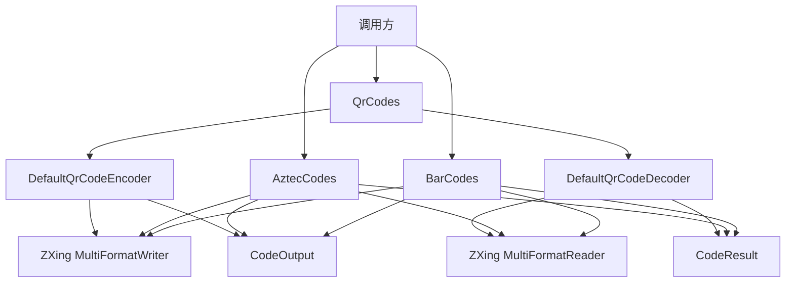

# zxing-extension

基于 ZXing Core 3.5.4 的纯 Java 扩展库，提供 QR Code、Aztec 和一维条形码的生成与解析。

本项目是独立 ZXing 扩展，不依赖 Spring、Spring Boot、Javalin、Quarkus 或 DDD4J。

## 能力

- QR Code：PNG、SVG、Base64、Data URI、彩色渐变、码眼颜色、Logo、外套壳、单码与多码解析。
- Aztec：尺寸、纠错百分比、quiet zone、PNG、Base64、常见输入解析。
- 一维条形码：EAN-8/13、UPC-A/E、Code 39/93/128、ITF、Codabar。
- 统一结果：所有码制共用 `CodeOutput` 和 `CodeResult`。
- JDK 8：不使用更高版本 Java API。

## Maven

```xml
<dependency>
    <groupId>io.github.hiwepy</groupId>
    <artifactId>zxing-extension</artifactId>
    <version>1.0.x.20260630-SNAPSHOT</version>
</dependency>
```

## 快速开始

### QR Code

```java
// 普通二维码
QrCodeOutput normal = QrCodes.encode("https://github.com/hiwepy");

// 彩色二维码
QrCodeOutput colorful = QrCodes.colorful("https://github.com/hiwepy");

// 带 Logo
BufferedImage logo = ImageIO.read(new File("logo.png"));
QrCodeOutput withLogo = QrCodes.withLogo("https://github.com/hiwepy", logo);

// 字节、Base64 和 Data URI
byte[] png = colorful.getBytes();
String base64 = colorful.base64();
String dataUri = colorful.dataUri();

// 解析
QrCodeDecodeResult result = QrCodes.decode(png);
String content = result.getText();
```

高级生成使用 `QrCodeRequest`：

```java
QrCodeOutput output = QrCodes.encoder().encode(
    QrCodeRequest.builder("hello")
        .size(430, 430)
        .margin(2)
        .errorCorrectionLevel(ErrorCorrectionLevel.H)
        .style(QrCodeStyle.builder()
            .foregroundColor(new Color(0, 122, 98))
            .gradientEndColor(new Color(69, 54, 143))
            .eyeColor(new Color(24, 45, 110))
            .build())
        .logo(QrCodeLogo.builder(logo).size(56, 28).build())
        .selfCheck(true)
        .build());
```

输出 SVG：

```java
QrCodeOutput svg = QrCodes.encoder().encode(
    QrCodeRequest.builder("hello")
        .format(QrCodeImageFormat.SVG)
        .build());
```

外套壳使用 `QrCodeFrame` 组合二维码、文字和图片元素：

```java
QrCodeFrame frame = QrCodeFrame.builder(420, 520)
    .addElement(QrCodeTextElement.builder("扫码查看详情")
        .bounds(100, 30, 260, 40)
        .font("SansSerif", 28, true)
        .build())
    .addElement(QrCodeBlockElement.builder()
        .x(50).y(100).width(320).height(320).zIndex(1)
        .build())
    .build();
```

多码解析：

```java
List<QrCodeDecodeResult> results = QrCodes.decoder().decode(
    QrCodeDecodeRequest.from(image)
        .multiple(true)
        .build());
```

### Aztec

```java
// 快捷生成与解析
CodeOutput output = AztecCodes.encode("hello-aztec");
CodeResult result = AztecCodes.decode(output.getBytes());

// 自定义尺寸、纠错百分比和 quiet zone
CodeOutput custom = AztecCodes.encode(
    AztecCodeRequest.builder("hello-aztec")
        .size(320, 280)
        .errorCorrectionPercent(40)
        .margin(4)
        .build());
```

### 一维条形码

```java
// EAN-13 快捷入口
CodeOutput ean13 = BarCodes.ean13("6901234567892");
CodeResult result = BarCodes.decode(ean13.getBytes());

// 其他一维码制
CodeOutput code128 = BarCodes.encode(
    BarCodeRequest.builder("ORDER-20260715", BarcodeFormat.CODE_128)
        .size(360, 120)
        .margin(8)
        .build());
```

## 输入与输出

三个门面保持一致的使用模式：

| 门面 | 快捷生成 | 高级生成 | 解析输入 |
|---|---|---|---|
| `QrCodes` | `encode`、`colorful`、`withLogo` | `QrCodeRequest` | `byte[]`、`BufferedImage`、`File`、`Path`、`InputStream` |
| `AztecCodes` | `encode` | `AztecCodeRequest` | 同上 |
| `BarCodes` | `ean13` | `BarCodeRequest` | 同上 |

`CodeOutput` 提供：

- `getBytes()`
- `image()`
- `base64()`
- `dataUri()`
- `writeTo(OutputStream)`
- `getWidth()` / `getHeight()` / `getMimeType()`

调用方传入的 `InputStream` 和 `OutputStream` 均不会被库关闭。

## 架构



设计约束：

- QR 的 L/M/Q/H 与 Aztec 的纠错百分比不是同一语义，因此分别建模。
- 一维码制没有 Logo、渐变和外套壳，不暴露无效参数。
- 三种码制共享真正相同的输出与解析结果，不使用弱类型 hints 作为公共 API。
- 核心模块不下载远程 URL，避免引入 SSRF 风险。

## 主要结构

```text
com.google.zxing
├── QrCodes.java
├── AztecCodes.java
├── BarCodes.java
├── DefaultQrCodeEncoder.java
├── DefaultQrCodeDecoder.java
├── model/
│   ├── CodeOutput.java
│   ├── CodeResult.java
│   ├── QrCodeRequest.java
│   ├── AztecCodeRequest.java
│   ├── BarCodeRequest.java
│   ├── QrCodeStyle.java
│   └── QrCodeLogo.java
├── frame/
└── source/
```

## 构建验证

```bash
./mvnw clean test
```

## License

Apache License 2.0。
